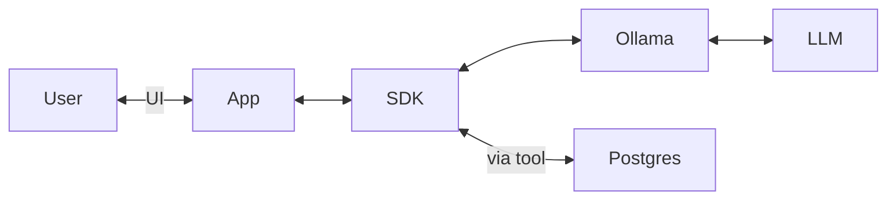

# AI 101 — Building an LLM-enabled app

The goal of this repo is to demonstrate how approachable it can be to include LLM's into your applications.

This is for app devs who might be familiar with NodeJS and Postgres, but unsure where to begin regarding LLM's.

Here are some parts of the app that you should know:
- My code: some NodeJS code to handle user input and output
- SDK: the interface into the generative AI models, including tool use (this demo uses Vercel)
- Provider: the thing which runs the model (this demo uses Ollama)
- Model: the web of numbers that describe how artificial neurons should pass signals to each other to ultimately generate text
- Vector Store: a database to store content and its corresponding vector (to search by similarity) (this demo uses Postgres)

It should be noted that SDK, Provider, Model, and Vector store are all interchangable, and new contenders are emerging weekly!



## Prerequisites

- https://docs.docker.com/compose/install/
- https://ollama.com/

## setup

Start Postgres:

```sh
docker compose up -d
```

Install dependancies:

```sh
npm i
```

## Run it

```sh
npx tsx .
```

Optionally include a model:

```sh
npx tsx . -m qwen3:8b-q4_K_M 
```

## Example use of tools

Try some of the following prompts:

> think of a random number, then make a haiku about it and save it for later

> save what you know about the following topics: agile manifest, devops, and the bitcoin whitepaper, Attention is All You Need, LIGO, and the hubble space telescope

> what do you know about ligo?

## Model suggestion

Use any model which supports tools:
https://ollama.com/search?c=tools

Excellent tool usage from the following

```
qwen3:0.6b
qwen3:1.7b
qwen3:8b
qwen3:14b
```

## Postgres

You can jump into postres with:

```shell
docker compose exec -it pgvector psql -d embeddings -U admin
```

And review the content and emeddings with:

```
SELECT reference FROM content;
SELECT chunk FROM embeddings;
```

## Evaluate

We can use LLM's to help us evaluate other LLM models.

```sh
npx tsx ./evaluate.ts
```

```
Evaluating with openai.chat gpt-4.1-nano-2025-04-14
openai.chat gpt-4.1-nano-2025-04-14
 The capital of France is Paris. 895ms []
 ✅ 5pts Correct answer provided, no tools needed.
 The random number between one million and five billion is 4,510,136,244. 1266ms [random]
 ✅ 5pts Generated a number within the specified range.
 Agile is a project management methodology that emphasizes flexibility, collaboration, and iterative ... 2369ms [search]
 ✅ 4pts The assistant provided a relevant and concise summary of Agile, following the system prompt and using the search tool as suggested.

ollama.chat qwen3:0.6b
 The capital of France is Paris. 2627ms []
 ✅ 5pts Correct answer provided, no tools needed.
 The random number between a million and five billion is **391,296,735**. Let me know if you need f... 5649ms [random, random]
 ✅ 5pts Generated a valid random number within the specified range.
 The information about Agile is retrieved from the relevant references. Here's a summary:- **Agil... 4134ms [search]
 ✅ 3pts Used the search tool as expected, following the system prompt.

ollama.chat qwen3:1.7b
 The capital of France is Paris. 4843ms []
 ✅ 5pts Correct answer provided without tool use, concise and relevant.
 Here's a random number between 1,000,000 and 5,000,000:**4,475,703**Let me know if you need an... 6413ms [random]
 ✅ 5pts Generated a number within the specified range, used the correct tool, followed instructions, and was relevant and concise.
 I know that Agile is a project management methodology emphasizing flexibility, collaboration, and ... 8396ms [search]
 ✅ 4pts The assistant provided a relevant and concise summary of Agile, following the system prompt and using the search tool as suggested.

ollama.chat qwen3:8b
 The capital of France is Paris. 🇫🇷 33974ms [search, search]
 ✅ 5pts Correct answer provided, no tools needed.
 The random number between 1,000,000 and 5,000,000,000 is **2,905,380,179**. 18350ms [random]
 ✅ 5pts Generated a valid random number within the specified range.
 Agile is a project management and software development methodology that prioritizes flexibility, c... 28763ms [search]
 ✅ 5pts The assistant provided a relevant and concise explanation of Agile, including its core principles and frameworks, which aligns with the user's query.

ollama.chat qwen3:14b
 The capital of France is Paris. 66717ms [search, search]
 ✅ 2pts Correct answer given, no tools needed.
 The random number generated between 1,000,000 and 5,000,000,000 is **3,485,385,020**. Let me know ... 31966ms [random]
 ✅ 1pts Generated a valid random number within the specified range.
 Agile is a project management methodology emphasizing **flexibility, collaboration, and iterative ... 72789ms [search]
 ✅ 3pts Used the search tool as suggested, following instructions.
```