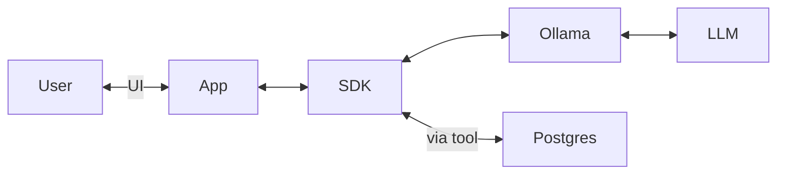

# AI 101 — Building an LLM-enabled app

The goal of this repo is to demonstrate how approachable it can be to include LLM's into your applications.

This is for app devs who might be familiar with NodeJS and Postgres, but unsure where to begin regarding LLM's.

Here are some parts of the app that you should know:

- My code: some NodeJS code to handle user input and output
- SDK: the interface into the generative AI models, including tool use (this demo uses Vercel)
- Provider: the thing which runs the model (this demo uses Ollama)
- Model: the web of numbers that describe how artificial neurons should pass signals to each other to ultimately generate text
- Vector Store: a database to store content and its corresponding vector (to search by similarity) (this demo uses Postgres)

It should be noted that SDK, Provider, Model, and Vector store are all interchangable, and new contenders are emerging weekly!



## Prerequisites

- https://docs.docker.com/compose/install/
- https://ollama.com/ (or you can use Docker)

## Setup

Create the docker compose stack:

```sh
make up
```

If you want to run Ollama inside Docker (a perfectly good option, but often better value to install it).
Review `./compose/ollama.yml` for available profiles — example:

```sh
PROFILE=cpu make up
PROFILE=gpu-nvidia make up
```

Install dependencies:

```sh
npm i
```

## Run it

```sh
npx tsx ./src/cli
```

Optionally specify a model to query:

```sh
npx tsx ./src/cli -m qwen3:8b-q4_K_M
```

## Example use of tools

Try some of the following prompts:

> think of a random number, then make a haiku about it and save it for later

> save what you know about the following topics: agile manifest, devops, and the bitcoin whitepaper, Attention is All You Need, LIGO, and the hubble space telescope

> what do you know about ligo?

## Model suggestion

Use any model which supports tools:
https://ollama.com/search?c=tools

Excellent tool usage from the following

```
qwen3:0.6b
qwen3:1.7b
qwen3:8b
qwen3:14b
```

_Note:_ Usage of a new model requires pulling that new model to the `ollama-pull` service in the `compose/ollama.yml` file. e.g. `ollama pull qwen3:1.7b`.

## Postgres

You can jump into postres with:

```shell
docker compose exec -it pgvector psql -d embeddings -U admin
```

And review the content and emeddings with:

```
SELECT reference FROM content;
SELECT chunk FROM embeddings;
```

## Evaluate

We can use LLM's to help us evaluate other LLM models.

```sh
node --import tsx --enable-source-maps --test ./tests/**/*.test.ts
```

You can see the results are interesting but not without error:

See sample run: [tests/results/2025-05-13T12:35:29.826Z.md](./tests/results/2025-05-13T12:35:29.826Z.md)
